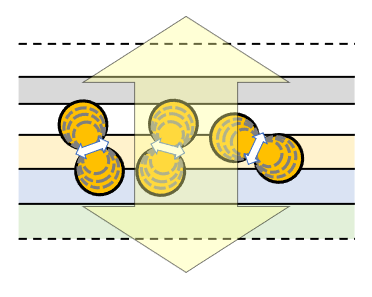
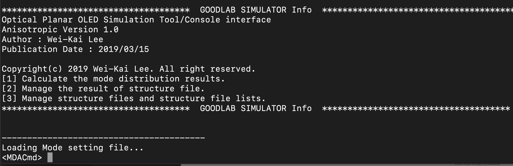
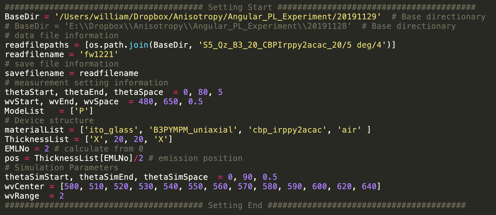
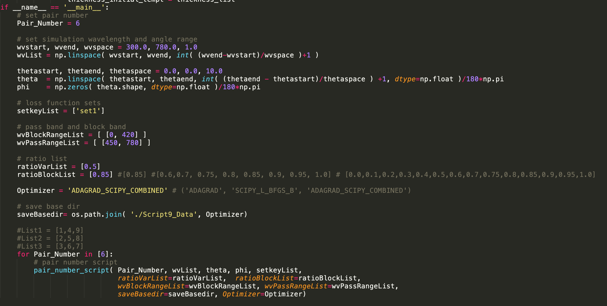

# Planar Optics Simulator

## objective

<p align="center">

</p>


Planar Optics Simulator is an optical **design**/**simulation**/**emitter parameter extraction** tool built by python3. 

This module is basically for the planar optical structure based on the plane wave expansion method considering anisotropic refractive index, field distribution, anisotropic emitter's orientation (ensemble) of planar structure.

In this software, there are ***two different user interface***, including ***command line*** and ***graphic user interface (GUI)***.

> Since the software is built on python3, please install python3 and some third-party modules listed as below first before execute the software. 

> Although the optical model contains biaxial refractive index situation, it has not been realized in the program.

## pip install

This module would use numpy, spicy, pandas, matplotlib for terminal usage. Please install these module first before start. 

```shell
pip install numpy spicy pandas matplotlib
```

Or numpy, spicy, pandas, matplotlib, PyQt5, pyqtgraph, and qdarkstyle for GUI usage. Please install these module first before start. 

``` shell
pip install numpy spicy pandas matplotlib 
```

``` shell
pip install PyQt5 pyqtgraph qdarkstyle
```

[Note] Sometimes the software might not be executed successfully. Please check whether it is the OS issue.<br/>[Note] Since this software is based on numpy, if you would like to speed up the numpy calculation on windows, please install numpy+mkl first. [Python Extension Packages](https://www.lfd.uci.edu/~gohlke/pythonlibs/#numpy).

## A. User Interface-Optical Simulation

### Command Line-src/Execution

[More details in User_Manual_Cmd](https://github.com/d04943016/Planar-Optics-Simulator-User_Manual/tree/main/User_Manual_Cmd)

#### Example

<p align="center">

</p>


#### Commands Python Modules [The user manual is in ./User Manual Cmd/]

1. ***materialMgrCmd.py***

   ``` shell
   python materialMgrCmd.py 
   ```

   or 

   ``` shell
   python materialMgrCmd.py "command file name"
   ```

   > Material manager libraries.

2. ***materialOpticsCmd.py***

   ``` shell
   python materialOpticsCmd.py
   ```

   or

   ``` shell
   python materialOpticsCmd.py "command file name"
   ```

   > Calculate the plane wave properties in a given material.

3. ***DeviceOpticsCmd.py***

   ``` shell
   python DeviceOpticsCmd.py
   ```

   or

   ``` shell
   python DeviceOpticsCmd.py "command file name"
   ```

   > This module is used to calculate the direction of the fields, including electric field and magnetic field, in the material, and also calculate z compnent wave number in each layers in a given device.

4. ***rtauCmd.py***

   ``` shell
   python rtauCmd.py.py
   ```

   or

   ``` shell
   python rtauCmd.py "command file name"
   ```

   > A. Calculate the reflection and transmission coefficients of a given device. <br/>Note: <br/>    r31 is for the incidence with mode 1 (TE+) and reflection with mode 3 (TE-). <br/>    r42 is for the incidence with mode 2 (TM+) and reflection with mode 4 (TM-). <br/>    tau11 is for the incidence with mode 1 (TE+) and transmission with mode 1 (TE+). <br/>    tau22 is for the incidence with mode 2 (TM+) and transmission with mode 2 (TM+). <br/>
   >
   > B.  Calculate the field distribution, including electric field (E) and magnetic field (H),  in a coherent set with emitter ensemble. <br/>

5. ***TRACmd.py***

   ``` shell
   python TRACmd.py
   ```

   or

   ``` shell
   python TRACmd.py "command file name"
   ```

   > Calculate the transmittance, reflectance, and absorption of a planar strucuture.  <br/>This module considers coherent and incoherent alternating planar structure.  <br/>

6. ***DeviceFieldCmd.py***

   ``` shell
   python DeviceFieldCmd.py
   ```

   or

   ``` shell
   python DeviceFieldCmd.py "command file name"
   ```

   >  Calculate the field distribution, including electric field (E) and magnetic field (H),  in a coherent set with emitter ensemble.

7. ***PowerDensityCmd.py***

   ``` shell
   python PowerDensityCmd.py
   ```

   or

   ``` shell
   python PowerDensityCmd.py "command file name"
   ```

   > A. Calculate power density  in incoherent layer region.
   >
   > B. Calculate power density  in incoherent layer region.
   >
   > Calculate power density  in a coherent set along z axis.

8. ***PurcellFactorCmd.py***

   ``` shell
   python PurcellFactorCmd.py
   ```

   or

   ``` shell
   python PurcellFactorCmd.py "command file name"
   ```

   > Calculate the Purcell factor.

9. ***ModeDistributionAnalyzerCmd.py***

   ``` shell
   python ModeDistributionAnalyzerCmd.py
   ```

   or

   ``` shell
   python ModeDistributionAnalyzerCmd.py "command file name"
   ```

   > Calculate the coupling efficiency into different mode.

10. ***DataMatrixAnalyzerScript.py***

    ``` shell
    python DataMatrixAnalyzerScript.py		
    ```

    > Rearrange the 2D data of mode distribution.

11. ***FarFieldCmd.py***

    ``` shell
    python FarFieldCmd.py
    ```

    or

    ``` shell
    python FarFieldCmd.py "command file name"
    ```

    > Calculate the far field emission patterns, angle-dependent spectra, and angle-dependent CIE coordinate. 

12. ***LazyCmd.py***

    ``` 		shell
    python LazyCmd.py
    ```

    > A python script file containing all the other commands. The user can directly modify the code and execute the script without any terminal commands.
    >
    > All the options are stored in src/Command/cmdInitializer.py.

### GUI-src/GUI_PyQt5/Panel.py 

[More details in User_Manual_GUI](https://github.com/d04943016/Planar-Optics-Simulator-User_Manual/tree/main/User_Manual_GUI)

The execution file is in ./src/GUI_PyQt5/Panel.py.

``` shell
python Panel.py
```

Or just double click in windows (please install python and the third-party module first).

<p align="center">

</p>

There are three major parts on GUI. The left panel shows the information of structures, the right panel shows the material properties, and the middle panel shows the functions listed as the following.

#### Functions

1. ***User***

   > The user panel can friendly switch between different users. According to the username, the simulation tool loads the different material libraries (nk, PL, and dipole orientation factors) and the default command setup automatically. If the username is not find in the SETTING directory, the program would also automatically built up a new user with empty material libraries. 
   >
   > Or if the user do not want to construct a new user and just want to use the default settings, the user do not need to construct a dummy username. "DEFAULT" is a default username when the software is executed and all the settings would be default value and the material properties library is in the default path.

2. ***device optics***

   > Device Optics module is used to calculate z component wave number in each layers in a given planar structure/device.

3. ***reflection/transmission coefficient (r/tau)***

   > Calculate the reflection and transmission coefficients of a given device. <br/>Note: <br/>    r31 is for the incidence with mode 1 (TE+) and reflection with mode 3 (TE-). <br/>    r42 is for the incidence with mode 2 (TM+) and reflection with mode 4 (TM-). <br/>    tau11 is for the incidence with mode 1 (TE+) and transmission with mode 1 (TE+). <br/>    tau22 is for the incidence with mode 2 (TM+) and transmission with mode 2 (TM+). <br/>

4. ***field z distribution (external incidence)***

   > Calculate the field distribution, including electric field (E) and magnetic field (H),  in a coherent set with external incidence.

5. ***transmission/reflection/absorption(TRA)***

   > Calculate the transmittance, reflectance, and absorption of a planar structure.  <br/>This module considers coherent and incoherent alternating planar structure.  <br/>

6. ***field z distribution (Internal emission)***

   > Calculate the field distribution, including electric field (E) and magnetic field (H),  in a coherent set with emitter ensemble.

7. ***power density (coherent)***

   > Calculate power density  in a coherent set at emitter's positions and semi-infinite region.

8. ***power density (incoherent)***

   > Calculate power density in incoherent layer region.

9. ***power density z distribution***

   > Calculate power density  in a coherent set along z axis.

10. ***Purcell factor***

    > Calculate the Purcell factor.

11. ***mode distribution (efficiency)***

    > Calculate the coupling efficiency into different mode.

12. ***far field***

    > Calculate the far field emission patterns, angle-dependent spectra, and angle-dependent CIE coordinate. 

In each function, there are still several parameters need to be set. There are different kinds of parameters. Basically, they can be grouped into two categories, including input parameters and output parameters. 

(a) The input parameters might relate to the physical quantities of the plane wave, such as angle, tangential components of wave vector, z (position), integration parameters, and so on. Generally, the user need to give a series of number into these input parameters.

(b) The output parameters relate to the output form of the data, such as matrix format of data, line chart, contour, and so on. Or whether to generate the files corresponding to a specific mode. These parameters are usually checkboxs, specifying whether to output the data in the corresponding format. 

#### Output data

In every function, there would be a memo file which specifies the device number (index) of a device structure. Because in the optical simulation tool, scanning the structure is available for a lot parameters, there should be a table showing the relation between the device number and the device structure. Besides the memo file, several data list files would also be generated. A data list file would contain the simulated data of a device and the file name of the data list file would be named with device number.

Besides, since there are a lot of different output formats, whenever the checkbox is selected, the corresponding directory would be automatically generated to save the data. Sometimes, there would also be a lot of files in the directory because of a series of parameter scans. An additional index table file is automatically created to show the relation between the index and the parameters. The file name of the data would be named with such indexes. 

---

Notice: <br/>All the simulated data of each mode is labeled as 1, 2, 3, and 4. <br/>For isotropic materials or uniaxial materials with optic axis normal to the device plane (z axis): 

> mode 1 and 3 are for TE mode<br/>mode 2 and 4 are for TM mode<br/>mode 1 and 2 propagate toward +z<br/>mode 2 and 4 propagate toward -z<br/>

Biaxial materials have not been built in the program. <br/>

---

## B. User Interface (Only Cmd)-Dipole Orientation Factors and Intrinsic Spectrum Extractor 

Extract the dipole orientation factors from angle- and p-polarization spectrum measurement. <br/>The execution file is in src/Execution/DOFExtractor.py

``` shell
python DOFExtractor.py
```

<p align="center">

</p>


The user directly change the script file. <br/>

## C. User Interface (Only Cmd)-Optical Thin Film Designer

Design the high-pass and low-pass optical filter by gradient descent method ([forward and backward propagation method](https://github.com/d04943016/TMM)).<br/>

The execution file is in src/ThinFilmOptimizer

``` shell
python ThinFilmOptimizer_Script9.py
```

<p align="center">

</p>


## Information

---

**Author: Wei-Kai Lee (PhD, National Taiwan University (NTU), Taiwan)**<br/>**Built From: 2013-2021**<br/>**email: d04943016@ntu.edu.tw**<br/>**[LinkedIn](https://www.linkedin.com/in/wei-kai-lee-bab8b896/)**<br/>

***If there is any bug, please inform the authors.***

---

## Reference

#### Prof. Chung-Chih Wu, National Taiwan University (NTU), Taiwan

[1] [“Development of anti-UV structures for OLED displays using modified distributed Bragg reflector”, Optics Express, 29(5), 7654-7665 (2021)](https://www.osapublishing.org/oe/fulltext.cfm?uri=oe-29-5-7654&id=448584)<br/>[2] [“Enhance External Quantum Efficiency of Organic Light-Emitting Devices Using Thin Transparent Electrodes”, Organic Electronics, 89, 106057 (2021)](https://www.sciencedirect.com/science/article/abs/pii/S1566119920304456)]<br/>[3] [“Realization of Exceeding 80% External Quantum Efficiency In Organic Light-Emitting Diodes Using High-Index Substrates and Highly Horizontal Emitters”, Organic Electronics, 89, 106049 (2021)](https://www.sciencedirect.com/science/article/abs/pii/S1566119920304377)<br/>[4] [“High-Index Transparent Electrode as a New Dimension to Boost Organic Electroluminescence Efficiency: Realizing External Quantum Efficiency Exceeding 41%”, Organic Electronics, 87, 105984, (2020)](https://www.sciencedirect.com/science/article/pii/S1566119920303736)<br/>[5] ["Quantitative Analyses of High Electroluminescence Efficiency of Thermally Activated Delayed Fluorescence Emitters Based on Acridine-Triazine Hybrids", J. of Photonics for Energy, 8(3), 032105 (2018)](https://www.spiedigitallibrary.org/journals/journal-of-photonics-for-energy/volume-8/issue-03/032105/Quantitative-analyses-of-high-electroluminescence-efficiency-of-thermally-activated-delayed/10.1117/1.JPE.8.032105.full)<br/>[6] [“Achieving Nearly 30% External Quantum Efficiency for Orange–Red Organic Light Emitting Diodes by Employing Thermally Activated Delayed Fluorescence Emitters Composed of 1,8-Naphthalimide-Acridine Hybrids", Advanced Material, 30(5), (2018)](https://onlinelibrary.wiley.com/doi/full/10.1002/adma.201704961)<br/>[7] ["Effects of transparent bottom electrode thickness on characteristics of transparent organic light-emitting devices" Organic Electronics, 236–243 (2016)](http://www.sciencedirect.com/science/article/pii/S1566119916304347)<br/>[8] [“Achieving Above 60% External Quantum Efficiency in Organic Light-Emitting Devices Using ITO-Free Low-Index Transparent Electrode and Emitters with Preferential Horizontal Emitting Dipoles”, Advanced Functional Materials, 26(19), 3250-3258 (2016)](http://onlinelibrary.wiley.com/doi/10.1002/adfm.201505312/abstract)<br/>[9] [“Simple Planar Indium-Tin-Oxide-Free Organic Light-Emitting Devices Having Nearly 39% External Quantum Efficiency”, Advanced Optical Materials, 4(3), 365-370 (2015)](http://onlinelibrary.wiley.com/doi/10.1002/adom.201500576/full)<br/>[10] [“Unlocking the Full Potential of Conducting Polymer for High-Efficiency Organic Light-Emitting Devices”, Advanced Materials, 27, 929-934 (2014)](https://onlinelibrary.wiley.com/doi/full/10.1002/adma.201404546)<br/>[11] [“Enhancing Light Out-Coupling of Organic Light-Emitting Devices Using Indium Tin Oxide-Free Low-Index Transparent Electrodes” Applied Physics Letters, 104, 183302 (2014)](https://aip.scitation.org/doi/full/10.1063/1.4876607)<br/>

#### Prof. Wolfgang Brutting, University of Augsburg, Germany

[1] ["Extracting the emitter orientation in organic light-emitting diodes from external quantum efficiency measurements", Applied Physics Letters, 105, 043302 (2014)](https://aip.scitation.org/doi/10.1063/1.4891680)<br/>[2] ["Efficiency Enhancement of Organic Light‐Emitting Diodes Incorporating a Highly Oriented Thermally Activated Delayed Fluorescence Emitter", Advanced Functional Materials, 24(33), 5232-5239, (2014)](https://onlinelibrary.wiley.com/doi/abs/10.1002/adfm.201400495)<br/>[3] ["Device efficiency of organic light‐emitting diodes: Progress by improved light outcoupling", physics status solidi a, 210(1), 44-65 (2013)](https://onlinelibrary.wiley.com/doi/10.1002/pssa.201228320)<br/>[4] ["Oriented phosphorescent emitters boost OLED efficiency", Organic Electronics, 12(10), 1663-1668 (2011)](https://www.sciencedirect.com/science/article/abs/pii/S1566119911002205)<br/>[5] ["Evidence for non-isotropic emitter orientation in a red phosphorescent organic light-emitting diode and its implications for determining the emitter’s radiative quantum efficiency", Applied Physics Letters, 99, 163302 (2011)](https://aip.scitation.org/doi/10.1063/1.4891680)<br/>[6] ["Accessing OLED emitter properties by radiation pattern analyses", Organic Electronics, 12(1), 83-91 (2011)](https://www.sciencedirect.com/science/article/abs/pii/S1566119910003216)<br/>

#### Prof. Kristiaan Neyts, Ghent University, Belgium

[1] ["Anisotropic materials in OLEDs for high outcoupling efficiency", Optics Express, 23(16), 21128-21148 (2015)](https://www.osapublishing.org/oe/fulltext.cfm?uri=oe-23-16-21128&id=323759)<br/>[2] ["Dipole radiation within one-dimensional anisotropic microcavities: a simulation method", Optics Express, 19(19), 18558-18576 (2011)](https://www.osapublishing.org/abstract.cfm?uri=oe-19-19-18558)<br/>[3] ["Exceptionally efficient organic light emitting devices using high refractive index substrates", Optics Express, 17(9), 7562-7570 (2009)](https://www.osapublishing.org/oe/fulltext.cfm?uri=oe-17-9-7562&id=179276)<br/>[4] ["Simulation of light emission from thin-film microcavities", Journal of the Optical Society of America A, 15(4), 962-971 (1998)](https://www.osapublishing.org/josaa/abstract.cfm?uri=josaa-15-4-962)<br/>

#### Prof. J.J. Kim, Seoul National University, South Korea

[1] ["Luminescence from oriented emitting dipoles in a birefringent medium", Optics Express, 23(7), A279-A291 (2015)](https://www.osapublishing.org/oe/fulltext.cfm?uri=oe-23-7-A279&id=312564)<br/>[2] ["Highly Efficient Organic Light-Emitting Diodes with Phosphorescent Emitters Having High Quantum Yield and Horizontal Orientation of Transition Dipole Moments",  Advanced Materials, 26, 3844–3847 (2014)](https://onlinelibrary.wiley.com/doi/10.1002/adma.201305733)<br/>[3] ["Blue Phosphorescent Organic Light-Emitting Diodes Using an Exciplex Forming Co-host with the External Quantum Efficiency of Theoretical Limit", Advanced Materials, *26*, 4730–4734 (2014)](https://onlinelibrary.wiley.com/doi/10.1002/adma.201400955)<br/>[4] ["Sky-Blue Phosphorescent OLEDs with 34.1% External Quantum Efficiency Using a Low Refractive Index Electron Transporting Layer", Advanced Materials, *28*, 4920–4925 (2016)](https://onlinelibrary.wiley.com/doi/abs/10.1002/adma.201506065)<br/>

#### Prof. Karl Leo, Technische Universität Dresden, Germany

[1] ["Coupled plasmonic modes in organic planar microcavities", Applied Physics Letters, 100, 253301 (2012)](https://aip.scitation.org/doi/10.1063/1.4729820)<br/>[2] ["Comparing the emissive dipole orientation of two similar phosphorescent green emitter molecules in highly efficient organic light-emitting diodes, Applied Physics Letters, 101, 253304 (2012)](https://aip.scitation.org/doi/10.1063/1.4773188)<br/>[3] ["Outcoupling efficiency in small-molecule OLEDs: from theory to experiment", Proc. of SPIE Vol. 7617 761716 (2010)](https://www.spiedigitallibrary.org/conference-proceedings-of-spie/7617/761716/Outcoupling-efficiency-in-small-molecule-OLEDs--from-theory-to/10.1117/12.840043.short)<br/>[4] ["Quantification of energy loss mechanisms in organic light-emitting diodes", Applied Physics Letters, 97(25), 253305 (2010)](https://aip.scitation.org/doi/10.1063/1.3527936)<br/>


---

**For better viewing experience, please use Typora for tutorial reading.**

